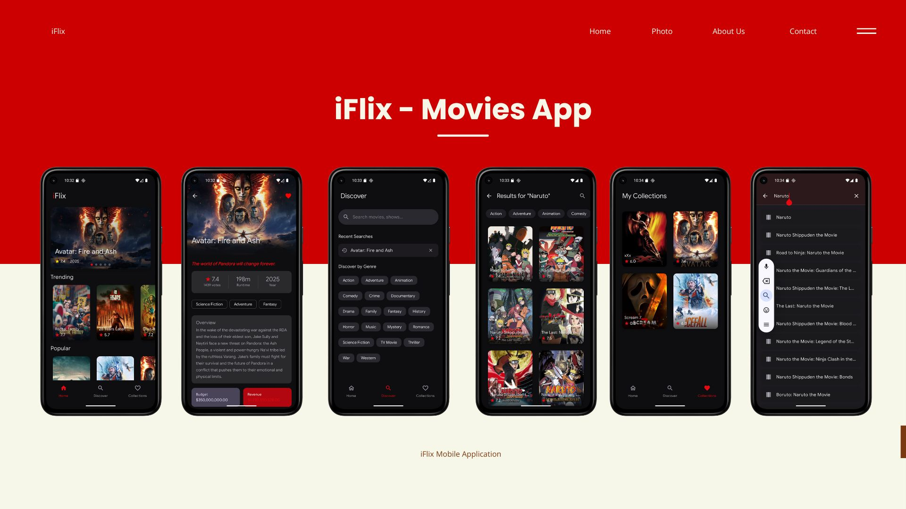

# iFlix - Modern Movie Discovery App

iFlix is a premium Android application designed for movie enthusiasts to discover, search, and manage their favorite films. Built with the latest Android technologies, it provides a seamless, high-performance experience with a modern Material 3 aesthetic.



## 🚀 Features

- **Dynamic Home Screen:** Explore Trending, Now Playing, Popular, and Top Rated movies with immersive banners and carousels.
- **Advanced Search & Discovery:**
    - **Real-time Live Search:** Get instant results as you type with debounced API calls.
    - **Multi-Genre Filtering:** Combine text queries with multiple genre filters simultaneously.
    - **Search History:** Quickly access recent searches with a "Clear All" and "Undo" deletion feature.
- **Detailed Movie Insights:** View comprehensive details including synopsis, genres, runtime, budget, and revenue.
- **Personal Collections:** Save your favorite movies locally using Room database.
- **Seamless UX:**
    - **Pull-to-Refresh:** Driven by Paging3 LoadState for reactive data updates.
    - **Smooth Animations:** Custom navigation transitions and animated search overlays.
    - **Offline Support:** Local caching of search history and favorites.

## 🛠 Tech Stack

- **Language:** [Kotlin](https://kotlinlang.org/)
- **UI:** [Jetpack Compose](https://developer.android.com/jetpack/compose) (Material 3)
- **Architecture:** Clean Architecture + MVI (Model-View-Intent)
- **Dependency Injection:** [Hilt](https://dagger.dev/hilt/)
- **Networking:** [Retrofit](https://square.github.io/retrofit/) & [Kotlinx Serialization](https://kotlinlang.org/docs/serialization.html)
- **Local Storage:** [Room Database](https://developer.android.com/training/data-storage/room)
- **Pagination:** [Paging 3](https://developer.android.com/topic/libraries/architecture/paging/v3-overview)
- **Concurrency:** [Kotlin Coroutines](https://kotlinlang.org/docs/coroutines-overview.html) & [Flow](https://kotlinlang.org/docs/flow.html)
- **Image Loading:** [Coil](https://coil-kt.github.io/coil/)

## 🏗 Architecture

The project follows **Clean Architecture** principles and is divided into two main modules:

### 1. `:core` (Data & Domain)
- **Source:** Handles Remote (TMDB API) and Local (Room) data sources.
- **Repository:** Implementation of data logic and PagingSource.
- **Domain:** Pure Kotlin UseCases that encapsulate business logic.
- **Model:** Shared data models across the application.

### 2. `:app` (Presentation)
- **MVI Pattern:** Uses StateFlow and SharedFlow (Mediator) to handle UI states and actions.
- **Navigation:** Type-safe navigation with custom slide/fade transitions.
- **Components:** Reusable UI elements like `CustomSearchBar`, `MovieCarousel`, and `IFlixScaffold`.

## 📸 Screenshots

| Home & Discovery | Search & Results | Details & Favorites |
|---|---|---|
|  |  |  |

## 🏁 Getting Started

### Prerequisites
- Android Studio Ladybug or newer
- JDK 17
- TMDB API Key

### Installation
1. Clone the repository:
   ```bash
   git clone https://github.com/arifamsar/iFlix.git
   ```
2. Open the project in Android Studio.
3. Add your TMDB API Key in `local.properties`:
   ```properties
   TMDB_API_KEY=your_api_key_here
   ```
4. Build and run the app!

### CI/CD Setup
To enable GitHub Actions CI/CD:
1. Go to your repository settings → Secrets and variables → Actions
2. Add a new repository secret named `TMDB_API_KEY` with your TMDB API key value
3. Push your changes to trigger the workflow

## 📄 License
This project is licensed under the MIT License - see the [LICENSE](LICENSE) file for details.

---
*Created with ❤️ by amsar*
